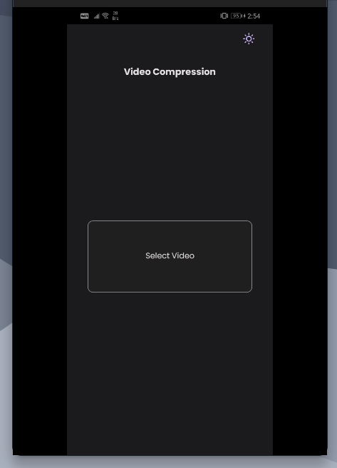
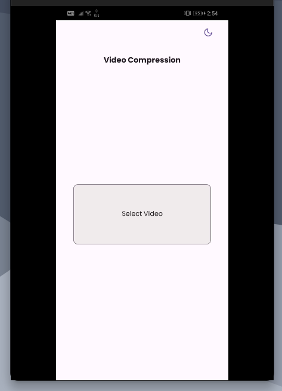
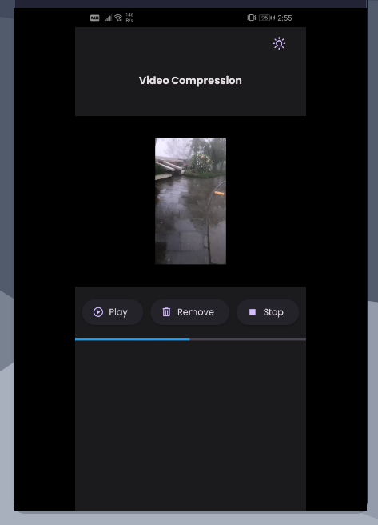
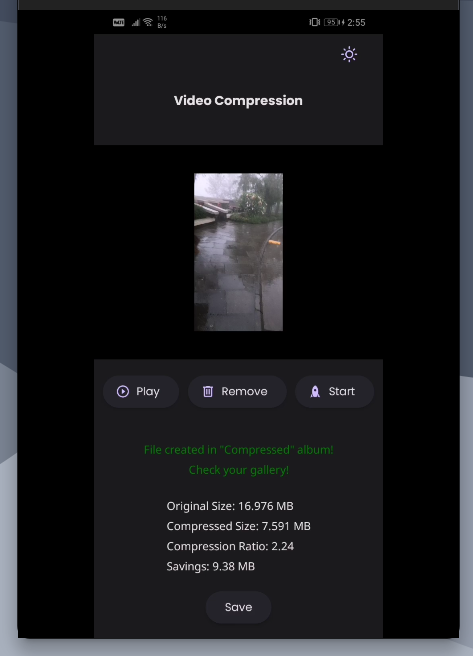
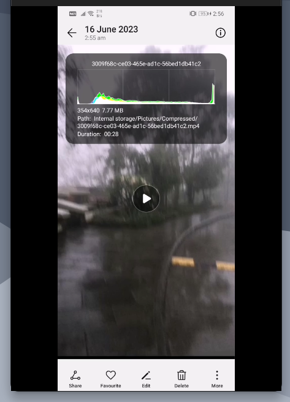

# Video Compression App

- Built using `React Native with Expo` and `TypeScript`
- Used:
  - `react-native-paper` for theming
  - `expo-av` for video playback
  - `react-native-compressor` library to compress the videos.
  - `expo-file-system` to delete cache when remove button is pressed.
  - `expo-media-library` to save the compressed video to an album.

### Screenshots:

Dark mode homescreen:

Light mode homescreen:

Compressing:

After compressing and saving:

Details about compressed video:

